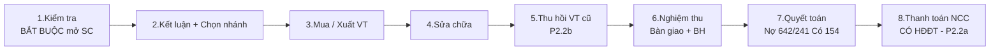
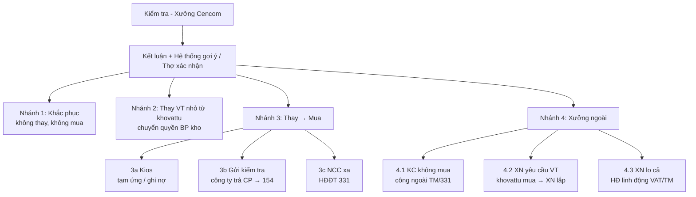
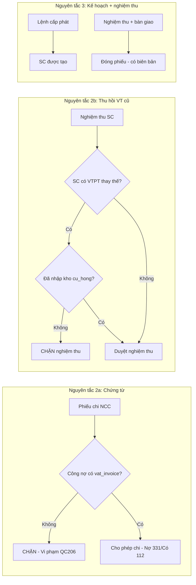
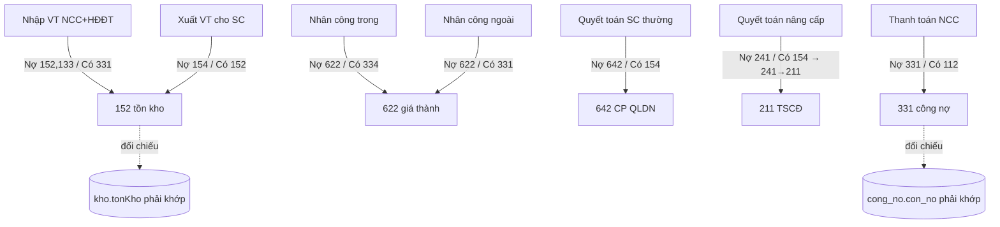
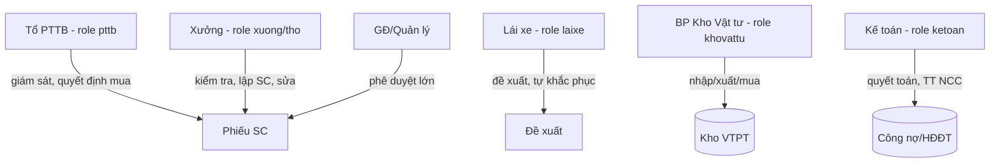

# 05 — FLOWCHART CHUẨN HÓA (QC206 + 8 BƯỚC KẾ TOÁN)

> Vẽ bằng Mermaid. Đưa vào tài liệu thiết kế (`docs/ui_v4/*` hoặc `docs/QC206_flow.md`).

## 1. 8 BƯỚC PROGRESS (thanh tiến trình SC)

> Quy tắc: `Kiểm tra` là **điều kiện cần để MỞ phiếu SC** — nếu chưa kiểm tra → không mở phiếu.

## 2. NESTED BRANCH TREE (cây quyết định 4 nhánh)

> Thợ/xưởng **chỉ** Kiểm tra + Lập SC (nhánh sửa tại xưởng). Từ nhánh 2/3/4, quyền **chuyển sang `khovattu`** (mua/xuất kho).

## 3. GATE tuân thủ (Nguyên tắc 2 & 3)

## 4. Ma trận nghiệp vụ ↔ bút toán (từ `plan_ketoan/read_06`)

## 5. Phân vai (RBAC) theo QC206

## 6. GHI CHÚ UI (theo quyết định 18.08 v2)
- **Dashboard master** = Expandable Card List (Shopify/Linear/Notion), KHÔNG dùng Kanban mặt định.
- **Card detail** = pipeline mini-graph (như §1–§2) + 8 bước progress + audit log.
- **Kanban** giữ lại dạng toggle nhẹ (4 cột: `cho_kiem_tra` / `dang_sua` / `cho_thanhtoan` / `hoanthanh`).
- **Timeline ngắn gọn + Alert icon** ⚠️ nếu thiếu HĐĐT (P2.2a) hoặc chưa thu hồi VT cũ (P2.2b).

> ⚠️ **Lưu ý:** Hiện `pttb`, `laixe` (thực), `khovattu` CHƯA có trong hệ thống → cần build theo `04-compliance-p2-p3.md` mục C trước khi flowchart này đúng thực tế.
